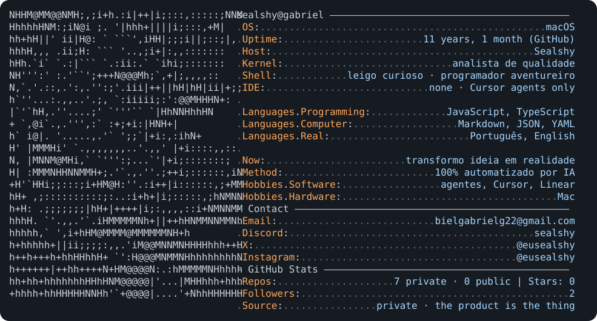
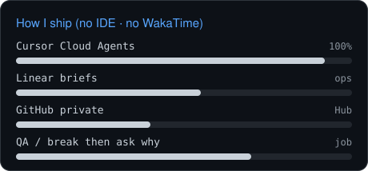
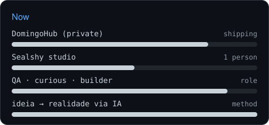

  

  leigo curioso · programador aventureiro · analista de qualidade 
  Sealshy · DomingoHub (source private)

<table width="100%">
  <tr>
    <td width="50%" valign="top">
      
    </td>
    <td width="50%" valign="top">
      
    </td>
  </tr>
</table>

 

  

